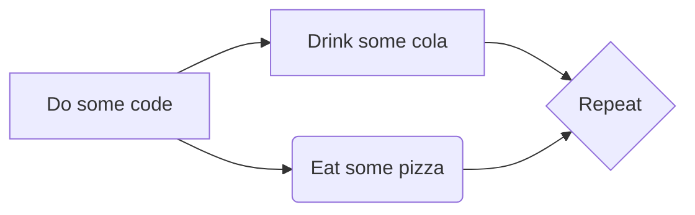

# Yatube_project

## Desciption

Social network of bloggers

## Technologies

Python 3.7.9
Django 2.2.19

Thats how we roll:

```mermaid
graph LR
A[Do some code] --> B[Drink some cola]
A --> C(Eat some pizza)
B --> D{Repeat}
C --> D
```

